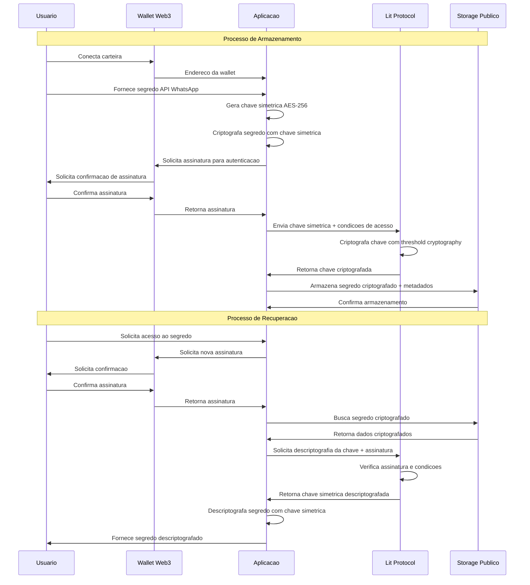

# web3-secret-lit-protocol
Como armazenar dados secretos em Bases de dados Publicas?

**Como armazenar dados secretos em Bancos de Dados Públicos via Web3 e Lit Protocol**

## Visão Geral



O `web3-secret-lit-protocol` é um projeto open source que demonstra como guardar informação sensível—como chaves de API do WhatsApp—em bases públicas, usando criptografia baseada em assinaturas de carteiras Web3.

Utiliza o protocolo descentralizado [Lit Protocol](https://litprotocol.com) e autenticação por assinatura de carteiras, garantindo que somente o dono da wallet consiga acessar o segredo armazenado.

***

## Funcionalidades

- **Criptografia Simétrica + Lit Protocol:** Segredos são criptografados usando AES-256, e a chave é protegida via Lit Protocol.
- **Autenticação Web3:** Apenas o usuário que assina pelo próprio endereço de carteira pode descriptografar e acessar o segredo.
- **Armazenamento Público Seguro:** Permite guardar dados criptografados em qualquer repositório público (ex.: IPFS, Arweave, bancos convencionais).
- **Integrável com fluxos de autenticação SIWE (Sign-In With Ethereum).**
- **Exemplo prático de uso com chave da API do WhatsApp.**

***

## Como funciona?

1. O usuário conecta sua carteira Web3.
2. O segredo (ex.: chave do WhatsApp) é criptografado localmente.
3. A chave de criptografia é protegida por condições de acesso do Lit Protocol, baseadas na identidade da carteira.
4. O segredo criptografado pode ser armazenado em qualquer banco público — só pode ser acessado mediante assinatura do dono.

***

## Instalação

```bash
git clone https://github.com/govinda777/web3-secret-lit-protocol.git
cd web3-secret-lit-protocol
npm install
```

***

## Uso

Exemplo básico para armazenar uma chave secreta:

```javascript
import { LitNodeClient } from '@lit-protocol/lit-node-client'

// Inicialize Lit Protocol
const litClient = new LitNodeClient({ litNetwork: 'datil' })
await litClient.connect()

// Defina condições de acesso (somente o dono da carteira pode abrir)
const accessControlConditions = [
  { chain: 'ethereum', method: '', parameters: [':userAddress'], returnValueTest: { comparator: '=', value: walletAddress } }
]

// Criptografe e armazene o segredo
const { ciphertext } = await litClient.encrypt({
  accessControlConditions,
  chain: 'ethereum',
  dataToEncrypt: whatsappApiKey
})
```

***

## Tecnologias

- [Lit Protocol](https://litprotocol.com)
- Web3.js / ethers.js
- IPFS / Arweave (opcional)
- SIWE / EIP-712 (para autenticação)

***

## Contribuindo

Contribuições são bem-vindas! Veja o arquivo [CONTRIBUTING.md](./CONTRIBUTING.md) para detalhes.

***

## Licença

MIT

***

## Dúvidas & Suporte

Abra uma Issue no GitHub ou fale com [Govinda Systems DAO](mailto:govinda777@gmail.com).

***

## Referências

- [Lit Protocol Developer Docs](https://developer.litprotocol.com)
- [SIWE - Sign-In With Ethereum](https://login.xyz/)
- [IPFS Storage](https://ipfs.io/)

***

**Comece agora a armazenar segredos de maneira realmente Web3!**

[1](https://github.com/govinda777/web3-secret-lit-protocol)
